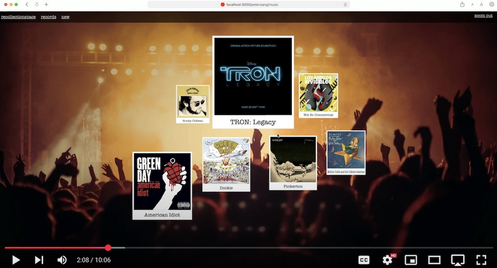

# Recollectionspace

[](https://www.youtube.com/watch?v=7v61OxlC-Q0)

[Watch the demo video](https://www.youtube.com/watch?v=7v61OxlC-Q0)

Recollectionspace is an innovative web application that reimagines traditional web navigation using a **Zooming User Interface (ZUI)**. Instead of navigating through conventional page transitions, users zoom in and out of visual objects to seamlessly traverse different URLs. Features include a Redux-based HTML Canvas drawing implementation (described in more detail [here](https://peterxjang.com/blog/a-functional-canvas-approach-with-redux-part-1.html)), lazy image loading based on visual geometry, custom animation engine, and cross platform input gestures for mouse and touch controls.

---

## 🚀 **Tech Stack**

- **Backend:** Ruby on Rails
- **Database:** PostgreSQL
- **Frontend:** Vanilla JavaScript
- **State Management:** Redux.js

---

## 🖥️ **Key Features**

- Zooming User Interface (ZUI), users zoom in and out of objects to navigate between urls
- Redux-based HTML Canvas with immutable state management (detailed description [here](https://peterxjang.com/blog/a-functional-canvas-approach-with-redux-part-1.html))
- Lazy image loading based on visibility within canvas zoom
- Cross-Platform Input Gestures, support for both mouse and touch controls for zooming, panning, and object interactions.
- Cloudinary API for image uploads
- OpenLibrary, The Movie Database (TMDB), MusicBrainz APIs for media information

## 🛠️ **Setup Instructions**

1. **Clone the repository:**
   ```bash
   git clone https://github.com/yourusername/recollectionspace.git
   cd recollectionspace
   ```
2. **Install dependencies:**
   ```bash
   bundle install
   ```
3. **Setup the database:**
   ```bash
   rails db:create
   rails db:migrate
   rails db:seed
   ```
4. **Start the server:**
   ```bash
   rails server
   ```
5. **Access the app:**
   Open your browser and navigate to `http://localhost:3000`
